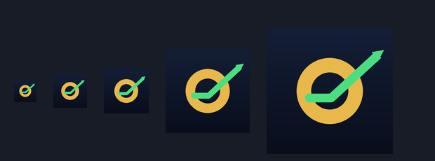

# LIFE ZERO — the mark



A gold zero with a green line breaking upward out of it.

The line starts **inside** the zero and runs flat, because that is where this company is: 22 days,
$0, no customers. Then it turns and leaves the ring. The mark is the thing the whole organization
exists to do — get the line off zero — rather than a decoration that could belong to any business.

## Why it is drawn this way

- **The line does not run straight across.** A horizontal bar through a circle reads as a
  prohibition sign at 32px. It was drawn that way first, checked at icon sizes, and changed.
- **Gold ring, green line.** Two colours, maximum separation, no gradient inside the mark. The
  tile behind it carries a quiet navy gradient so it is not a flat block.
- **Heavy strokes.** The ring is 11.5% of the canvas and the line 7%. Anything thinner disappears
  in a favicon.

## Files

| File | Use |
|---|---|
| `icon-180.png` | iOS home screen (`apple-touch-icon`) |
| `icon-192.png`, `icon-512.png` | Android home screen, via `manifest.json` |
| `icon-rounded-512.png` | Android maskable, and anywhere that does not apply its own mask |
| `icon-32.png`, `icon-48.png`, `icon-64.png` | favicons |
| `icon-1024.png` | store listings, printing, anything large |
| `mark.svg` | the mark alone, no tile — for headers and documents |
| `manifest.json` | web app manifest |

Square icons are **full-bleed with no rounded corners and no transparency**: iOS applies its own
mask, and a pre-rounded icon ends up with doubled corners. The rounded files exist for surfaces
that do not mask.

## Regenerating

```
python3 scripts/build_logo.py
```

Drawn from primitives in Pillow — no traced or third-party artwork. Editing the script is how the
mark changes; the PNGs are output, not sources.
